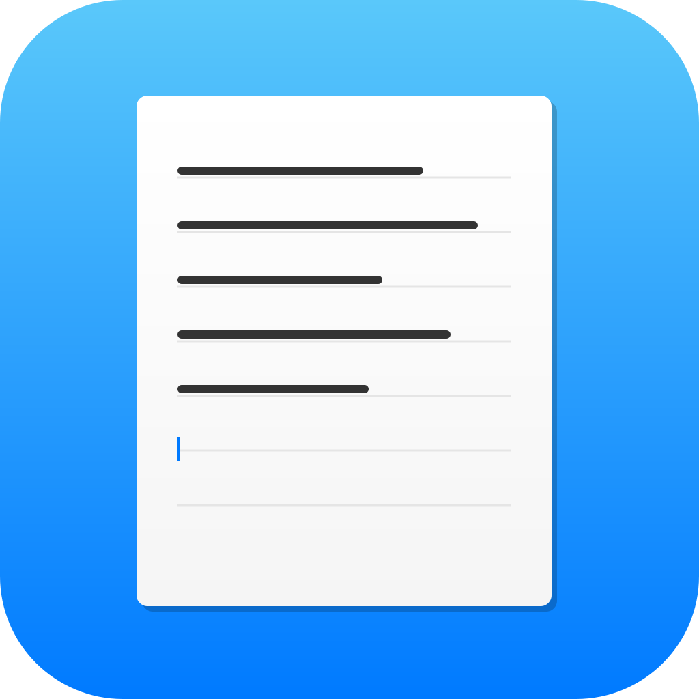

# Notepad for macOS

<p align="center">
  
</p>

<h3 align="center">The Simple, Fast Text Editor You've Been Missing on Mac</h3>

<p align="center">
  <strong>Finally, a lightweight Notepad alternative for macOS — just like the one you loved on Windows.</strong>
</p>

<p align="center">
  <a href="https://github.com/martinsantos/notepadmacos/releases/latest">
    
  </a>
  <a href="https://github.com/martinsantos/notepadmacos/releases">
    
  </a>
  <a href="LICENSE">
    
  </a>
</p>

<p align="center">
  <a href="#-download">Download</a> •
  <a href="#-features">Features</a> •
  <a href="#-screenshots">Screenshots</a> •
  <a href="#-keyboard-shortcuts">Shortcuts</a> •
  <a href="#-installation">Installation</a>
</p>

---

## 🚀 Why Notepad for macOS?

Switched from Windows to Mac and miss the simplicity of Notepad? **TextEdit** is bloated. **VS Code** is overkill for quick notes. You just want a **fast, simple text editor** that opens instantly and gets out of your way.

**Notepad for macOS** is exactly that:

- ⚡ **Instant startup** — no splash screens, no loading
- 📝 **Plain text focused** — no formatting, no distractions
- 🪶 **Lightweight** — under 5MB, uses minimal resources
- 🍎 **Native macOS feel** — designed for your Mac

## 📥 Download

<p align="center">
  <a href="https://github.com/martinsantos/notepadmacos/releases/latest/download/Notepad.dmg">
    
  </a>
</p>

**Requirements:** macOS 10.15 (Catalina) or later

> 💡 **Tip:** After downloading, drag Notepad to your Applications folder. If macOS blocks the app, right-click and select "Open".

## ✨ Features

### 📑 Multiple Tabs
Work with several files at once. Open, edit, and switch between documents seamlessly.

### 📌 Pinned Files
Keep your most-used files always accessible. Pin important documents for one-click access.

### 🕐 Recent Files (Last 30)
Quickly reopen recent documents. Also accessible from the macOS Dock menu.

### ⏮️ Version History
Every change is saved. Browse and restore any previous version of your document.

### 💾 Auto-Save
Never lose your work. Sessions persist even after closing the app.

### ⌨️ Keyboard First
Full keyboard shortcut support for power users. Work faster without touching the mouse.

## 📸 Screenshots

<p align="center">
  <i>Clean, minimal interface focused on your text</i>
</p>

<!-- Add screenshots here when available -->

## ⌨️ Keyboard Shortcuts

| Action | Shortcut |
|--------|----------|
| New Document | `⌘ N` |
| New Tab | `⌘ T` |
| Open File | `⌘ O` |
| Save | `⌘ G` |
| Save As | `⇧⌘ G` |
| Close Tab | `⌘ W` |
| Find | `⌘ F` |
| Find & Replace | `⌘ H` |
| View History | `⌘ Y` |
| Undo | `⌘ Z` |
| Redo | `⇧⌘ Z` |

## 📦 Installation

### Option 1: Download DMG (Recommended)

1. [Download the latest DMG](https://github.com/martinsantos/notepadmacos/releases/latest)
2. Open the DMG file
3. Drag **Notepad** to your **Applications** folder
4. Done! Launch from Applications or Spotlight

### Option 2: Build from Source

```bash
# Clone the repository
git clone https://github.com/martinsantos/notepadmacos.git
cd notepadmacos

# Install dependencies
npm install

# Run in development mode
npm start

# Build the app
npm run build
```

## 🛠️ Tech Stack

Built with modern technologies:

- **Electron** — Cross-platform desktop framework
- **Vanilla JavaScript** — No heavy frameworks, maximum performance
- **Native macOS APIs** — Dock integration, file associations

## 🤝 Contributing

Contributions are welcome! Feel free to:

- 🐛 Report bugs
- 💡 Suggest features
- 🔧 Submit pull requests

## 📄 License

MIT © [Martín Santos](https://github.com/martinsantos)

---

<p align="center">
  <strong>⭐ Star this repo if you find it useful!</strong>
</p>

<p align="center">
  Made with ❤️ for the Mac community
</p>

<p align="center">
  <sub>Keywords: notepad mac, notepad macos, notepad for mac, simple text editor mac, lightweight text editor macos, plain text editor mac, windows notepad alternative mac, fast text editor macos, minimal text editor mac, notepad replacement macos</sub>
</p>
